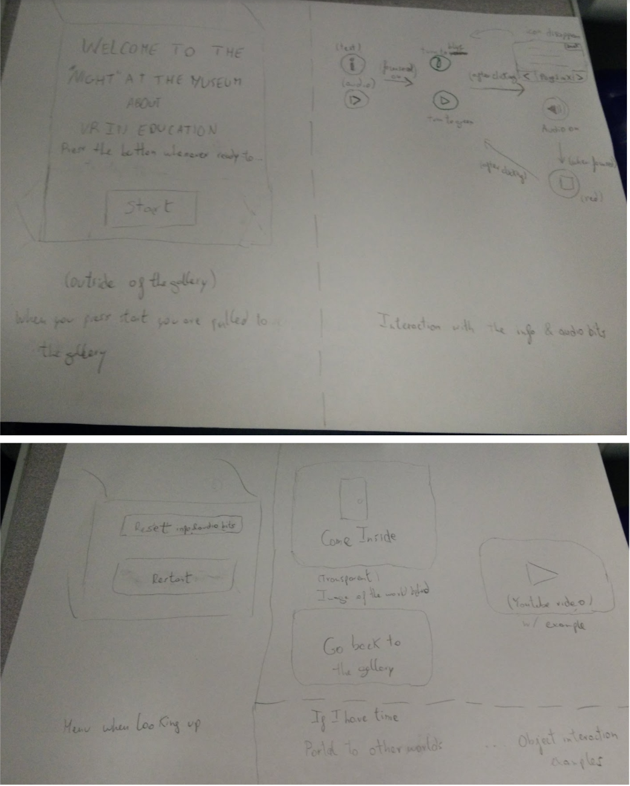
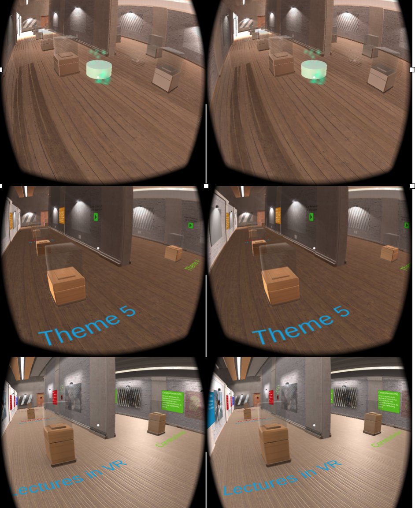

# Night at the Museum – VR in Education
Link for write-up: https://discussions.udacity.com/t/night-at-the-museum-write-up-tiago-silva/634006
Platforms: Unity 2017 2.0 and Google SDK 1.70

**(You can read the full project description below)**

As part of the coursework for Udacity’s VR Developer Nanodegree, I designed, user tested and iterated a mobile VR experience called **Night at the Museum**. The goal of this project was to develop a VR exhibition about how VR could impact a specific industry. The industry that I have chosen was Education because I am interested in how VR might change the way people learn. This experience is for Android users, and it was developed using Unity 2017 2.0 and Google SDK 1.70.

## Introduction

For this project, the audioclips were uploaded from [freesound.org](https://freesound.org/), and the remaining assets in the gallery from the Unity Asset Store. I have placed the credits in the end of the document.

**(Click on the image below to see the experience trailer)**

This project's goal was to let students and teachers know more about VR in Education. Throughout the exhibit, some applications that they can use at home or at school are provided. For this exhibit I focused on 5 topics: 
- Simulations and Constructing your own knowledge; 
- Impact of VR in Education; 
- Lectures in VR?! How different (and immersive) can they be?; 
- The social in VR – Collaboration, Communication and Empathy
- Precautions when delivering content and how to use VR 

I have also made a walkthrough of the game so people can see how the exhibition looks like beforehand.

This game took approximately 7 days to complete. In terms of development, the biggest struggle I had was with the images on the walls, which become occluded when they are far from the player. I couldn't make it work.
But the biggest struggle I had during this project was time to develop it. It was hard to decide what I wanted to do vs. time to develop and test them. 

I had to make some compromises. However, these compromises were a great learning experience because as a future developer, when time is due, it is essential to restrict yourself to the fundamentals and not letting yourself deviate from track. And improve on it in the future.

So, I hope to take a second look to this project and improve it in the near future.

## The process

The goal of this project was to develop a nice and informative experience about VR in Education. To build this experience, I used personas, sketches, game iterations and user testing. The design process provided by Udacity professors this term proved to be quite useful. Without it, it would have been very hard to test all the important factors (like scale, lighting, audio, movement, game mechanics and simulation sickness) that make a great VR experience and stay on track in developing the essential parts for this experience.

### Personas

**Mary**

Age: 16
Occupation: High school student
VR experience: Little
Quote: At school it is impossible to do things that are either too expensive to try out or are too dangerous.
> *I wish to study medicine in the future to become a surgeon. Or maybe a physicist. But it is hard to know what I will choose. School will not let me go to CERN or to a hospital seeing a crazy surgery like Grey’s Anatomy. Not seeing how these places work, makes it is hard for me to make a decision.*

**Joan**

Age: 37
Occupation: High school Teacher in a private school
VR experience: Little but very interested
Quote: As technology evolves it gets harder to keep student focused in classes 
> *I see students losing interest for learning what I teach, even though I try my best to make my biology classes as interactive as possible. They know far more interesting things are out there, and I wish I could give them these experiences. But with all these national examinations and school grades, it is hard to find time to challenge them in new ways (and for me to research them). I have a feeling that VR can be a gamechanger to students learn in a more personalized manner. But I don’t know how.*

### Sketches

In terms of environment, I have chosen a Showroom from the asset store. From that moment, I began sketching possible UI interactions with the start menu and to play/show information on the walls, as you can see below. 

> Due to time constraints, I ended up not implementing the info button interface, restart menu, and youtube video uploads.

### Game iterations and User Testing

I user tested each project iteration on a different person and I asked them questions. Each iteration focused on different aspects (they are in order):
- **Showroom appearance and movement with ground raycasting** - scale, distance of objects, lighting and setting the game area mood;
- **UI objects: Start Menu, Background Audio, Random Audio Clips to Play and Text** - check if these UI are easy to understand and to use, and if the audio gives a nice feeling to the experience.
- **Final version with content** - Place researched content in the exhibition and check overall experience. In the end ask, how enjoyable were the contents and the exhibition.

Because of the performance, I had to change the lighting and textures that came with Showroom package. From the first to the second iteration I changed the textures for optimal mobile performance. However, I still had problems with the lighting scheme (which was in realtime), and it is very costly in terms of performance. It also did not look as nice as the first iteration. So, from the second to the third iteration I created and uploaded a lightmap of the environment beforehand and things started to run smoothly and with a nice look and feeling. The only downside is the application is heavier now, but most of the “heavy computations” are made while loading.

> Differences between each iteration: the first one [very slow] on top to the last. 

#### User Test 1: Showroom appearance and movement with ground raycasting
User 1 only saw the first iteration. She felt well inside of the showroom. She understood it was a gallery. She felt the objects were at her height and at a nice distance between each other. The movement was fluid and it was intuitive moving around the gallery. She did not feel sick.

#### User Test 2: UI objects: Start Menu, Background Audio, Random Audio Clips to Play and Text
User 2 felt confused right from the start with the background sound. I had added a sound sample of people talking with each other, but when the headphones were too loud it was quite disorientating. 
When he entered the gallery, he felt like he was getting in a Windows 95 Wallpaper xD
He could see well the objects from a distance and clearly. However, the show cubes are a bit too low and to see him he felt like he had to lower his head too much.
At the time, I wanted to to replicate the real world, so I would overlap the background sound with other audio clips placed in the 3D environment. However, the user felt the background sound as a scratching noise that would not let him hear the other clips properly. 
After testing the application myself, I decided to avoid overlapping audio clips, and now the user only hears a sound at the time (background sound or an audio clip). 
After this test and talking with the user, we agreed changing the background sound into something more chill, increase the height of the show cubes. 

#### User Test 3: Final version with content
User 3 enjoyed very much the experience. The objects were at a nice height, and he especially enjoyed the 3D sound. The movement was fluid and he did not feel disoriented. The only complaint was the images far away from the player were not displayed properly.
I tried to fix this issue but I couldn’t.

## Breakdown of the final piece

**(Click on the image below to see the experience trailer)**

The game starts with a welcome menu outside of the gallery. The music is relaxing and it welcomes you to go in and learn more about the exhibition. Once you click ‘start exhibit’ you are pulled to the gallery. From that moment on, you can move around by clicking on the green cylinder. See and read more on whichever topic you like. The topics are written on the floor. On the walls you have text and images related to topic in question. In Lectures and Impact of VR in Education you are able to click and listen / stop to audio clips.

## Conclusion - Personal thoughts

I enjoyed a lot doing this project. I learned a lot on VR in Education and this was the first project that I have developed from scratch without an exact guideline. User testing and iterating amazes me because these methodologies are very simple to use, and the project rips huge gains. 
My testers enjoyed a lot the experience. Some of the testers were first time VR users so it was very exciting to see them playing and enjoying something I developed.
Even though there were many things I would have liked to have done, projects are made of deadlines and decisions have to be made. I am happy with the decisions I have made, and I hope you enjoy this experience as much as I did while developing it. 

### Next Steps
- Add portals to other scenes, so people can get a clearer understanding of the potential of VR
- Zoom in and out from a scene to show different perceptions of the same location
- Add info points, that when triggered, display its associated text
- Play with a player scale to change the person’s perception of a problem
- Add youtube videos
- Add objects inside of the boxes
- Let users interact with objects in the vicinity
- Create my own virtual environment

### About me and VR
I started this VR developer degree because I want to develop new ways for people to interact with information, through XR and data visualization. I believe overlaying digital information over the physical “realm” will change the way people interact with information and learn. I am very excited to work for this learn more about this medium and VR!

### Research References
- [Virtual Reality for Education website](http://virtualrealityforeducation.com/resources/)
- [Video: Designing for virtual reality and the impact on education | Alex Faaborg | TEDxCincinnati] (https://www.youtube.com/watch?v=DQMA5NNhN58) 
- [Video: This is Real - Immersive VR Education](https://www.youtube.com/watch?v=hrpytToK67E) 
- Paraphrased [Seymour Papert: The Children’s Machine](https://www.goodreads.com/book/show/906120.The_Children_s_Machine?from_search=true) on Why computers did not change children’s education
- Inspiration from [Voices of VR podcast](http://voicesofvr.com/)

### Assets
**Audio:**
- Background music: [Strings 1.wav by Isolda](https://freesound.org/people/Isolda/sounds/400823/) 
- Audio Clips on the wall: 
  - [Engage Virtual Reality Education Platform](https://www.youtube.com/watch?v=t-Qo_CNyHV8)
  - [3 Ways Virtual Reality Can Enhance Learning](https://www.youtube.com/watch?v=jRQzl8ewDMQ)
  - [Video: Designing for virtual reality and the impact on education | Alex Faaborg | TEDxCincinnati](https://www.youtube.com/watch?v=DQMA5NNhN58)
  - [Seymour Papert on Technology for Children](https://www.youtube.com/watch?v=IhEovwWiniY)
  - [Virtalis VR Collaboration](https://www.youtube.com/watch?v=ZEznhwf3PM8)

**Others:**
- [Showroom Environment made by NOVA SHADE](https://assetstore.unity.com/packages/3d/environments/showroom-environment-73740) 
- [Vector Icons made by UNRULY GAMES](https://assetstore.unity.com/packages/2d/gui/icons/simple-vector-icons-101218) 
- [iTween by PIXELPLACEMENT](https://assetstore.unity.com/packages/tools/animation/itween-84)
